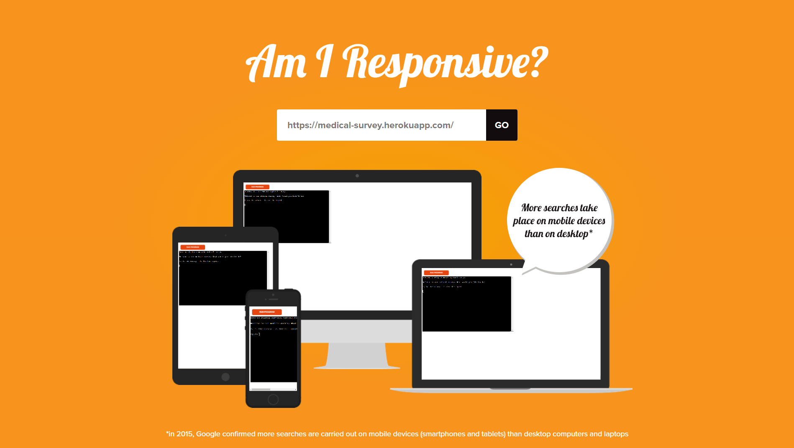

<h1 align="center">3P Juan Jose Ruiz Ruiz - Medical Survey</h1>

[View the live project here.](https://medical-survey.herokuapp.com/)

This app is a simulation of a medical survey in a terminal, where the user can choose if participate in the survey or get a report with the stats of the survey.

<h2 align="center"></h2>

## How to use

This app opens giving a choice to the user, who can choose between two options: participate in the survey or to see a report 
with stats of the answers given by all the previous users.

If the user chooses to participate in the medical survey, he/she can choose between the given options with numbers, or writing in case there is no options to choose. When he/she finishes, all the data is going to be stored in a google sheet.

On the other hand, if the user chooses to get report, the terminal automatically is going to get the data from the google sheet
and print it on the terminal.

## Features

-   Accepts user input

-   Input validation and error-checking
    -   The user must answer with a number contained within the options given.
    -   When the user is asked about his/her name, he/she must give an only-text answer.

-   Store data in external google sheet

-   Get data from external google sheet

## Testing

I have manually tested this project by doing the following:
    -   Passed the code through a PEP8 linter and confirmed there are no problems.
    -   Given invalid inputs: strings when numbers are expected, out of bounds inputs.
    -   Tested in my local terminal and the Heroku terminal.   

### Bug Log

-   Question validation not working correctly - Added answer list to the question class for better organization.
-   Can not properly include yes/no answer in report - Changed yes/no question type for option for simplified flow.
-   Report is checking each question twice - Refactored report function and found an extra loop that was giving the problem.
-   Can not store the report values in the google sheet - Decided to show the report directly in the terminal

### Validator Testing

-   PEP8
    -   Installed and used PEP8 formatter in the project.

## Deployment

This project was deployed in the Heroku's terminal.

-   Steps for deployment:
    -   Set the requirements for the project in the requirements.txt file
    -   Fork this repository
    -   Create a new Heroku app
    -   Set the CREDS Var in the app settings
    -   Set the buildbacks to Python and NodeJS in that order
    -   Link the Heroku app to the repository
    -   Click on Deploy

## Credits

### Code

-   The main references used to build this website are the Love Sandwiches CI project for Python reference.

### Content

-   All content was written by the developer, based in the projects and templates given by Code Institute and my mentor help.

### Acknowledgements

-   My Mentor for continuous helpful feedback and resources.
-   The Slack community for the instant help whenever I needed it.
